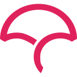
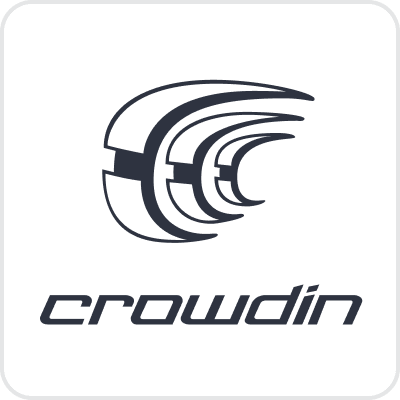
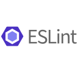
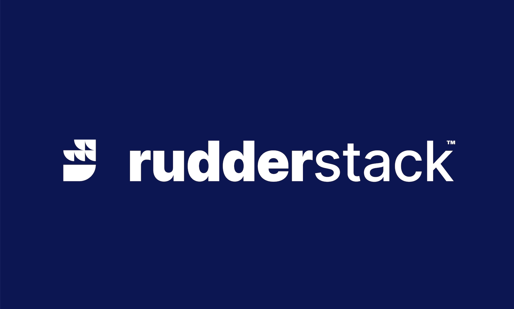

### Hi there 👋 I am Varun from India

<h2>
<a href="https://www.linkedin.com/in/androidvarun/">
  
</a>
<a href="mailto:varuntandon28121993@gmail.com">
  
</a>
<a href="https://twitter.com/meeVarunAhe">
  
</a>
</h2>

<br />

- 👨‍💻 I'm an Android App Developer with 6+ years experience, including cross-platform mobile development frameworks.
- I was appointed Android Tech Lead in a cybersecurity firm and we built [this](https://play.google.com/store/apps/details?id=com.safehouse.bodyguard)
- 🔭 I was responsible for directing the development of a blockchain [wallet](https://play.google.com/store/apps/details?id=com.jasiriwallet) app for Algorand block with an awesome team.
- Learning building backend with KTor.
- Loves the curves and edges of designing complex systems.
- Feels Purposeful when helping other achieve their dreams.
- Aspire to be a Solutions Architect, AND Going for it with full force!
- 🎯 I love well-architectured apps.
- :coffee: A coffee lover.
- 🏠 I live in Delhi, India.


<details>
<summary><h3><u>Digitally multi-lingual</u></h3></summary>

<a href="#pro_language">
 
</a>
<a href="#pro_language">
 
</a>
<a href="#pro_language">
 
</a>
<a href="#pro_language">
 
</a>

</details>

<details>
<summary><h3>Tools and Tech</h3></summary>

<a href="#tech_and_tools">
 
</a>
<a href="#tech_and_tools">
 
</a>
<a href="#tech_and_tools">
 
</a>
<a href="#tech_and_tools">
 
</a>
<a href="#tech_and_tools">
 
</a>
<a href="#tech_and_tools">
 
</a>
<a href="#tech_and_tools">
 
</a>
<a href="#tech_and_tools">
 
</a>
<a href="#tech_and_tools">
 
</a>
<a href="#tech_and_tools">
 
</a>
<a href="#tech_and_tools">
 
</a>
<a href="#tech_and_tools">
 
</a>
<a href="#tech_and_tools">
 
</a>
<a href="#tech_and_tools">
 
</a>
<a href="#tech_and_tools">
 
</a>
<a href="#tech_and_tools">
 
</a>
<a href="#tech_and_tools">
 
</a>
<a href="#tech_and_tools">
 
</a>
<a href="#tech_and_tools">
 
</a>
<a href="#tech_and_tools">
 
</a>
<a href="#tech_and_tools">
 
</a>
<a href="#tech_and_tools">
 
</a>
<a href="#tech_and_tools">
 
</a>
<a href="#tech_and_tools">
 
</a>
<a href="#tech_and_tools">
 
</a>
<a href="#tech_and_tools">
 
</a>
</details>

<details>
<summary><h3>⚡️ More about my coding life</h3></summary>

<p align = "center">


</p>

</details>

<details>
<summary><h3>⚡️ More stats</h3></summary>

<!--START_SECTION:waka-->


**I'm an Early 🐤** 

```text
🌞 Morning                471 commits         ██████████░░░░░░░░░░░░░░░   40.99 % 
🌆 Daytime                548 commits         ████████████░░░░░░░░░░░░░   47.69 % 
🌃 Evening                73 commits          ██░░░░░░░░░░░░░░░░░░░░░░░   06.35 % 
🌙 Night                  57 commits          █░░░░░░░░░░░░░░░░░░░░░░░░   04.96 % 
```
📅 **I'm Most Productive on Wednesday** 

```text
Monday                   61 commits          █░░░░░░░░░░░░░░░░░░░░░░░░   05.31 % 
Tuesday                  171 commits         ████░░░░░░░░░░░░░░░░░░░░░   14.88 % 
Wednesday                547 commits         ████████████░░░░░░░░░░░░░   47.61 % 
Thursday                 175 commits         ████░░░░░░░░░░░░░░░░░░░░░   15.23 % 
Friday                   162 commits         ████░░░░░░░░░░░░░░░░░░░░░   14.10 % 
Saturday                 19 commits          ░░░░░░░░░░░░░░░░░░░░░░░░░   01.65 % 
Sunday                   14 commits          ░░░░░░░░░░░░░░░░░░░░░░░░░   01.22 % 
```


📊 **This Week I Spent My Time On** 

```text
💬 Programming Languages: 
No Activity Tracked This Week

🔥 Editors: 
No Activity Tracked This Week

🐱‍💻 Projects: 
No Activity Tracked This Week

💻 Operating System: 
No Activity Tracked This Week
```

**I Mostly Code in Kotlin** 

```text
Kotlin                   4 repos             ████████████░░░░░░░░░░░░░   50.00 % 
Dart                     2 repos             ██████░░░░░░░░░░░░░░░░░░░   25.00 % 
Swift                    1 repo              ███░░░░░░░░░░░░░░░░░░░░░░   12.50 % 
Java                     1 repo              ███░░░░░░░░░░░░░░░░░░░░░░   12.50 % 
```


 Last Updated on 09/05/2023 20:14:59 UTC
<!--END_SECTION:waka-->
</details>
